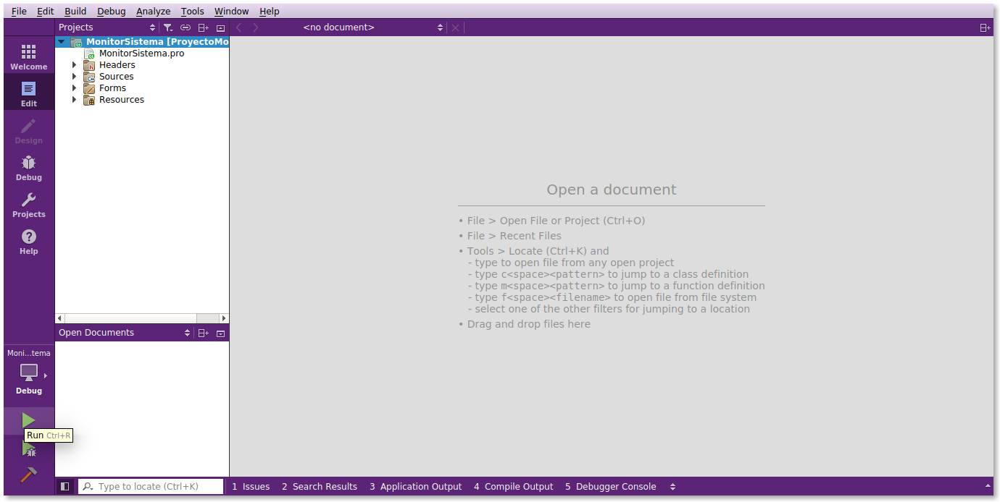

#Proyecto de Sistemas Operativos (2017 - 1).

## Autores
Quiñones Rivera Josué Emanuel.
Vázquez Álvarez Ángel Eduardo.

## Sinopsis
El monitor del sistema tiene como objetivo brindar a sus usuarios información útil sobre recursos básicos de su sistema de cómputo, tales como: información sobre la memoria RAM, información sobre las interrupciones del sistema e información sobre los dispositivos montados. Este es un programa diseñado principalmente para el sistema Ubuntu 16.04.

## Cómo compilar el programa.
Para utilizar el programa es necesario tener instalada la versión 5.7 de [Qt](https://www.qt.io/download/).

Una vez descargado, se utiliza la opción `Open Project` de la ventana principal de Qt y se localiza el archivo `MonitorSistema.pro`.

Al hacer esto, se desplegará la siguiente ventana 

Se verifica que la opción `Desktop Qt 5.7.0 GCC 64bit` esté habilitada y se hace click en el botón `Configure Project`.

Una vez hecho esto sólo se hace click en la punta de flecha verde en la esquina inferior izquierda de la pantalla como se muestra en 

