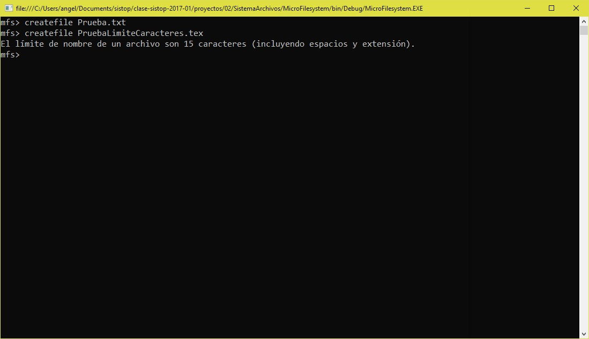
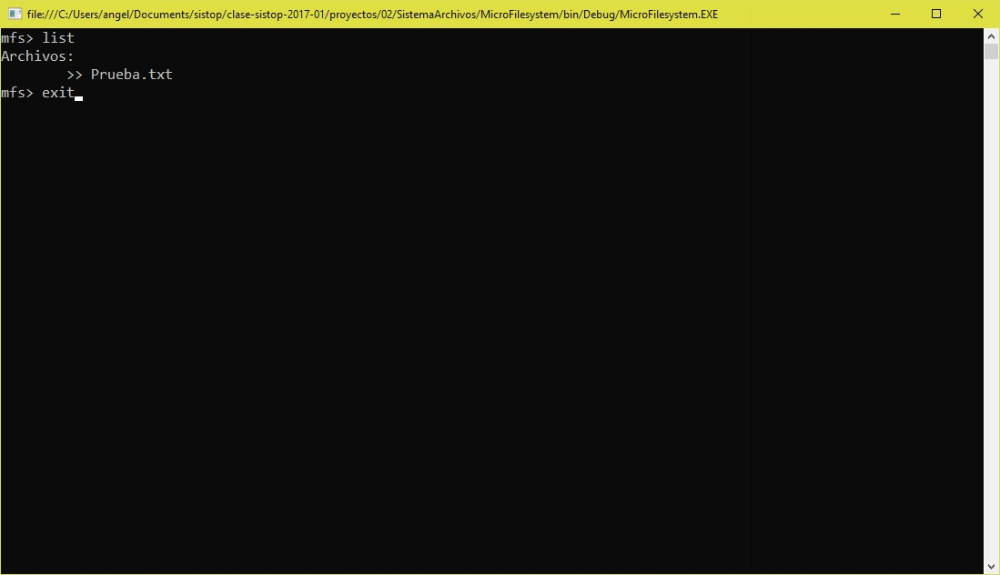
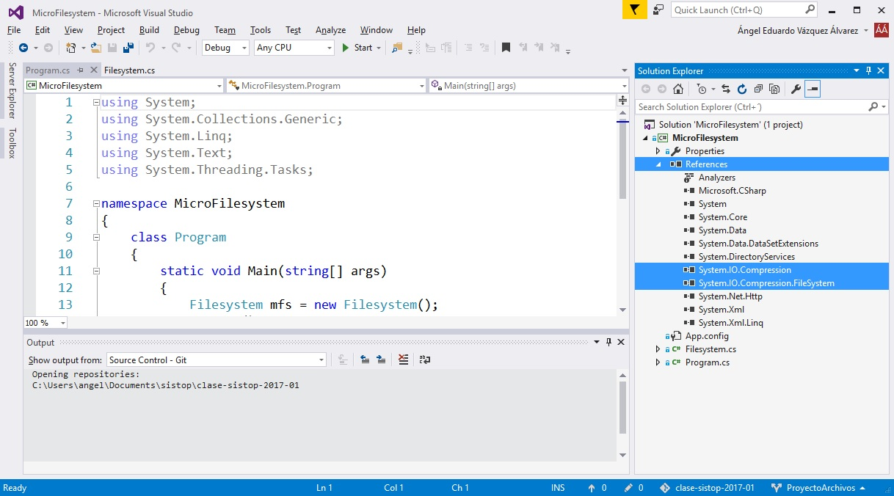

#Proyecto de evaluación 2 de Sistemas Operativos (2017-1).

##Autores
* Quiñones Rivera Josué Emanuel
* Vázquez Álvarez Ángel Eduardo

##Planteamiento del problema
La implementación de un sistema se archivos que contemple las operaciones básicas de el mismo. Básicamente tomando un archivo y dentro de el permitir las operaciones de manipulación de archivos.  
El programa consta con las operaciones de listar el directorio raíz, crear o eliminar un archivo del directorio, así como el manejo de archivos en modo lectura, escritura y edición. El (micro) sistema de archivos permite el uso interactivo con el usuario, siendo por si mismo una abstracción de la manipulación de objetos en memoria.  

##Lógica de operación
El sistema desarrollado consta de un archivo con formato zip en el cual se simulara el directorio raíz del sistema de archivos. Se crea también un directorio temporal (en tiempo de ejecución) donde se almacenarán todos los cambios que el usuario realice. Una vez terminada la ejecución del programa se guardan los cambios en el zip antes mencionado donde la información será persistente. Desplegando un "shell" se permite la interacción con el usuario mediante el uso de comandos preestablecidos, lo que permite listar, crear, borrar, entre otras operaciones a realizar con los archivos. Además se incluye un comando `help` para listar los comandos disponibles al usuario.  
Por ejemplo para la implementación de la función que permite crear un archivo nuevo:

La longitud del nombre del archivo no debe exceder el límite propuesto (15 caracteres incluyendo la extensión).  

Para el caso del comando `exit`:

Se guardan los cambios en el zip y se destruye el directorio temporal.  

##Para la ejecución del programa

La implementación fue hecha en C# 6.0, apoyada por el IDE [Visual Studio Community 2015 Update 3](https://www.visualstudio.com/es/downloads/) en su versión 14.0. Para ejecutar el programa es necesario contar con `.NET Framework 4.5` debido a que la clase `ZipFile` existe a partir de esa versión la cuál se incluye en el IDE mencionado.  

###En Visual Studio
Para abrir el proyecto en esta IDE basta con abrir el archivo `MicroFilesystem.sln`. Antes de ejecutar el programa es necesario verificar que las referencias  a `System.IO.Compression` y ` System.IO.Compression.FileSystem`aparezcan en el apartado `Solution Explorer`(View: "Solution Explorer") como se muestra a continuación:

De no aparecer, obtendrá el siguiente mensaje de error al intentar compilar: **el nombre 'ZipFile' no existe en el contexto actual**. Para obtener más información sobre cómo agregar una referencia al proyecto en Visual Studio,  [consulte el siguiente enlace](https://msdn.microsoft.com/en-us/library/hh708954(v=vs.110).aspx). 

##Notas importantes a considerar
* Es importante remarcar que **no se debe borrar el archivo** `FileSystem.zip` incluido en el proyecto.
* Terminar la ejecución del programa exclusivamente utilizando el comando `exit` para que los cambios sean guardados correctamente. De no ser así, el directorio temporal no será destruido y en una ejecución posterior el programa marcará un error al intentar sobrescribir dicho directorio.
* **Ponernos 10 :^)**